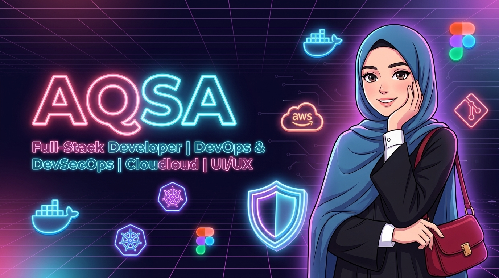

  <!-- Top Animated Wave Header -->
  

    

  <!-- Main Custom Styled Banner -->
  

    

  <!-- Animated Greeting with Waving Hand GIF -->
  <h1>Hi there , I'm Aqsa!</h1>

  

    <strong>Full-Stack Developer • UI/UX Designer • DevOps & DevSecOps Specialist • Cloud & SRE Engineer</strong>
  

  <!-- Dynamic Typing SVG -->
  

    
  

   

  <!-- Social & Contact Badges -->
  

    
    &nbsp;
    
  

  

    
  

<!-- Animated Glowing Line Divider -->

 

  <h2>📖 About Me</h2>
  

    I am a passionate <b>Full-Stack Developer</b>, <b>UI/UX Designer</b>, and <b>DevOps & DevSecOps Engineer</b>. 
    Specialized in building scalable applications, modern intuitive user interfaces, and production-ready, automated deployment pipelines with continuous security integration.
  

  <blockquote>✨ <i>"Design with intent. Develop with precision. Deploy with confidence."</i></blockquote>

 

<!-- Animated Glowing Line Divider -->

 

<table width="100%">
  <thead>
    <tr>
      <th width="50%"><h3>📱 Full-Stack & UI/UX Focus</h3></th>
      <th width="50%"><h3>🚀 DevOps & Cloud Architecture</h3></th>
    </tr>
  </thead>
  <tbody>
    <tr>
      <td valign="top" align="left">
         
        🎨 <b>UI/UX Design:</b> Wireframing & Prototyping in Figma  
        📱 <b>Mobile Development:</b> Cross-platform apps with Flutter & Dart  
        🌐 <b>Full-Stack Web:</b> Modern web solutions with JS, Python & PHP  
        ⚡ <b>API Development:</b> High-performance backends with FastAPI & Node.js  
        🗄️ <b>Database Design:</b> PostgreSQL, MongoDB, Supabase & Firebase  
        🔗 <b>Integration:</b> End-to-end RESTful API & state management 
         
      </td>
      <td valign="top" align="left">
         
        🐳 <b>Containerization:</b> Docker & Kubernetes workloads  
        ⚙️ <b>CI/CD Pipelines:</b> Automated deployments via GitHub Actions  
        🛡️ <b>DevSecOps:</b> SAST & security scanning (Trivy, Semgrep, CodeQL)  
        📜 <b>Infrastructure as Code:</b> Terraform & Ansible automation  
        ☁️ <b>Cloud Engineering:</b> Multi-cloud setups & Nginx web servers  
        🐧 <b>Linux Administration:</b> System management & Bash scripting 
         
      </td>
    </tr>
  </tbody>
</table>

 

<!-- Animated Glowing Line Divider -->

 

  <h2>💻 Tech Stack & Ecosystem</h2>

  <!-- Animated Skill Icons Grid -->
  

    
  

   

  <h3>🎨 UI/UX Design & Frontend</h3>
  

    
    
    
    
    
    
  

   

  <h3>🌐 Backend & Frameworks</h3>
  

    
    
    
    
    
  

   

  <h3>🐳 DevOps, Containers & IaC</h3>
  

    
    
    
    
    
    
  

   

  <h3>🛡️ DevSecOps & Security Tools</h3>
  

    
    
    
    
    
  

   

  <h3>🗄️ Databases & BaaS</h3>
  

    
    
    
  

   

  <h3>🛠️ Tools, OS & Platforms</h3>
  

    
    
    
  

 

<!-- Animated Glowing Line Divider -->

 

  <h2>📊 GitHub Activity & Analytics</h2>

  <!-- Animated Activity Graph Widget -->
  

    

  <!-- Verified Reliable Stats Cards -->
  
  

    

  <!-- Dev Quote Card -->
  

 

<!-- Animated Capsule Render Wave Footer -->

  
✨ Design • Develop • Deploy | Crafted with passion by <b>Aqsa</b>

