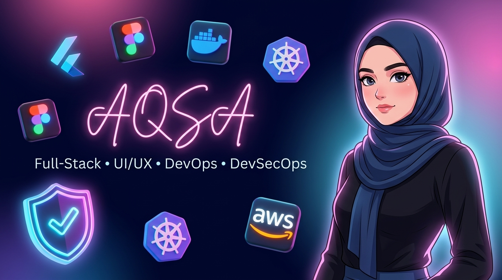

  <!-- Main Custom Styled Banner -->
  

    

  <!-- Animated Greeting -->
  <h1>👋 Hi, I'm Aqsa!</h1>

  

    <code><b>Full-Stack Developer</b></code> • <code><b>UI/UX Designer</b></code> • <code><b>DevOps & DevSecOps Specialist</b></code> • <code><b>Cloud Engineer</b></code>
  

  <!-- Dynamic Typing SVG -->
  

    
  

   

  <!-- Social & Contact Badges -->
  

    
    &nbsp;&nbsp;
    
    &nbsp;&nbsp;
    
  

  

    
  

<!-- Animated Glowing Line Divider -->

 

  <h2>✨ About Me</h2>
  

    I am a <b>Full-Stack Developer</b>, <b>UI/UX Designer</b>, and <b>DevOps & DevSecOps Engineer</b>. 
    I bridge the gap between aesthetic user experiences, robust backend systems, and automated, secure cloud infrastructure.
  

  <blockquote>🌸 <i>"Design with intent. Develop with precision. Deploy with security."</i></blockquote>

 

<!-- Animated Glowing Line Divider -->

 

<!-- Unique 3-Column Pillar Matrix Card Layout -->

<table width="100%">
  <thead>
    <tr>
      <th width="33%"><h3>🎨 UI/UX & Mobile</h3></th>
      <th width="33%"><h3>🌐 Full-Stack & APIs</h3></th>
      <th width="33%"><h3>🛡️ DevOps & DevSecOps</h3></th>
    </tr>
  </thead>
  <tbody>
    <tr>
      <td valign="top" align="left">
         
        🎨 <b>Figma Prototyping</b>  
        📱 <b>Flutter & Dart Apps</b>  
        ✨ <b>User Interface Design</b>  
        ⚡ <b>Responsive Web Layouts</b>  
        🎯 <b>Design System Specs</b> 
         
      </td>
      <td valign="top" align="left">
         
        🐍 <b>Python & FastAPI</b>  
        ⚡ <b>Node.js & Express</b>  
        🐘 <b>PHP & Web Backends</b>  
        🗄️ <b>PostgreSQL & MongoDB</b>  
        🔥 <b>Supabase & Firebase</b> 
         
      </td>
      <td valign="top" align="left">
         
        🐳 <b>Docker & Kubernetes</b>  
        ⚙️ <b>GitHub Actions CI/CD</b>  
        🛡️ <b>DevSecOps Scanning</b>  
        📦 <b>Terraform & IaC</b>  
        🌐 <b>Nginx & Cloud Servers</b> 
         
      </td>
    </tr>
  </tbody>
</table>

 

<!-- Animated Glowing Line Divider -->

 

  <h2>💻 Tech Stack & Tooling Ecosystem</h2>

  <!-- Animated Interactive Skill Icons Grid -->
  

    
  

   

  <h3>🎨 UI/UX & Mobile Development</h3>
  

    
    
    
    
    
    
  

   

  <h3>🌐 Full-Stack & Backend Systems</h3>
  

    
    
    
    
    
  

   

  <h3>🐳 DevOps, Infrastructure & DevSecOps</h3>
  

    
    
    
    
    
    
    
    
    
  

   

  <h3>🗄️ Databases & Cloud Services</h3>
  

    
    
    
    
    
  

 

<!-- Animated Glowing Line Divider -->

 

  <h2>📊 GitHub Activity & Analytics</h2>

  <!-- Animated Activity Graph Widget -->
  

    

  <!-- GitHub Contribution Grid Snake Animation -->
  <h3>🐍 GitHub Contribution Grid Snake</h3>
  

    

  <!-- Verified Reliable Stats Cards -->
  
  

    

  <!-- Dev Quote Card -->
  

 

  
✨ <b>Design • Develop • Deploy</b> | Crafted with passion by <b>Aqsa</b>

